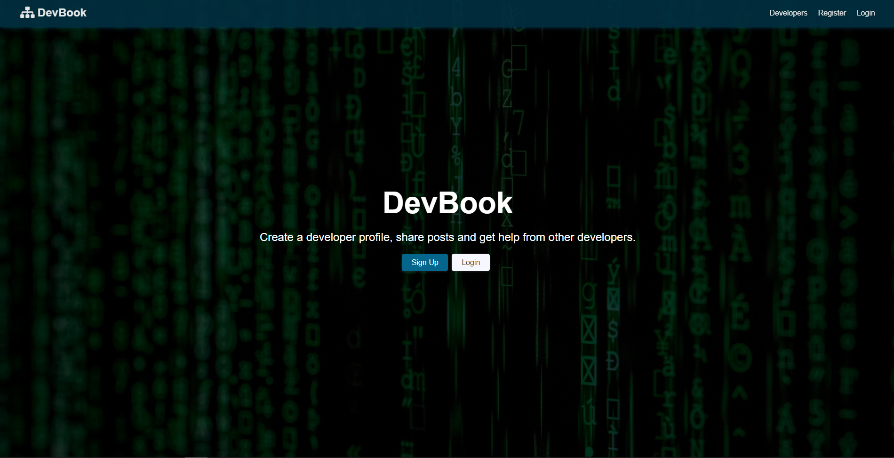
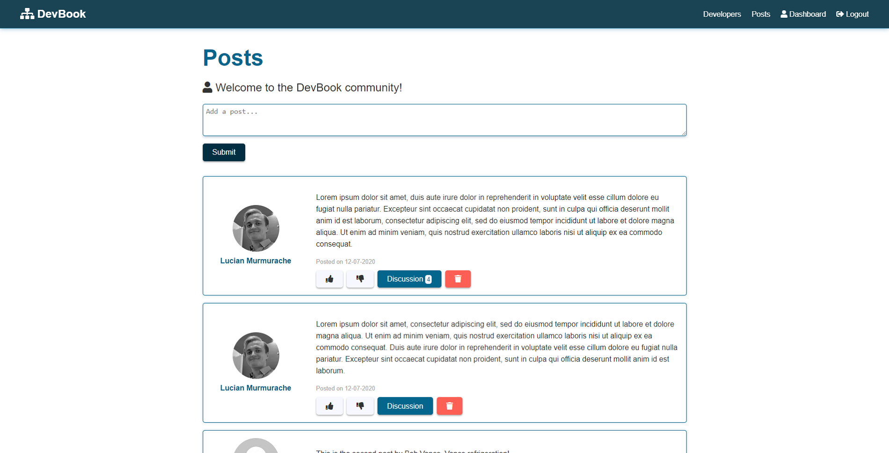
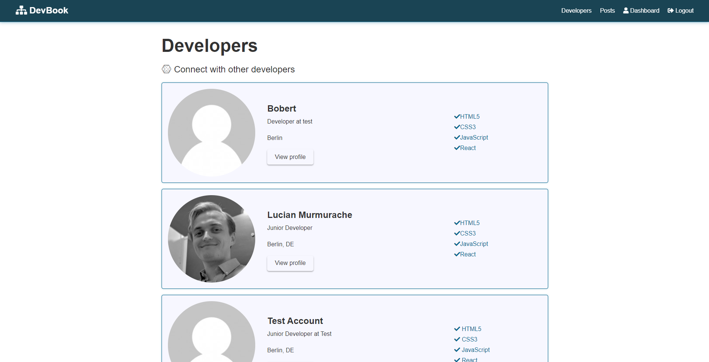

## DevBook

### [Demo](https://dev---book.herokuapp.com/)

### Summary:
 * A responsive social networking application built using _React_. 
 * Users can register, create a profile and connect with other users and discuss projects they built.
 * The application uses [Github APIs](https://developer.github.com/v3/) to load the 5 most recent repositories.

### Required Dependencies

 * To install all dependencies, you can simmply run **npm i** from the root directory.

 * Used dependencies: 
    * axios
    * bcryptjs
    * config
    * express
    * express-validator
    * gravatar
    * jsonwebtoken
    * mongoose
    * normalize-url
    * request
    * moment
    * react
    * react-dom
    * react-moment
    * react-redux
    * react-router-dom
    * react-scripts
    * redux
    * redux-devtools-extension
    * redux-thunk
    * uuid
    * dev-dependencies:
        - concurrently
        - nodemon
        - [:shipit:](https://www.youtube.com/watch?v=oHg5SJYRHA0)

 ### Installation instructions
 * Add a default.json file in config folder with the following
```
{
  "mongoURI": "<your_mongoDB_Atlas_uri_with_credentials>",
  "jwtSecret": "secret",
  "githubToken": "<yoursecrectaccesstoken>"
}
```
* Install server dependencies
```
npm install
```
* Install client dependencies
```
cd client
npm install
```
* Run Express & React **concurrently** from the root directory.
``` 
npm run dev 
```
* Test production before deployment
    - After running *build* in the client folder, *cd* into the root directory and run: 
      ```NODE_ENV=production node server.js```
    - Open your browser and navigate to [localhost:5000](http://localhost:5000/)

### Images




